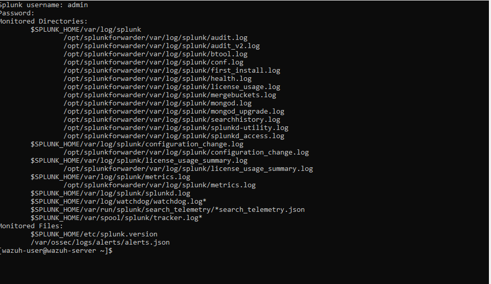
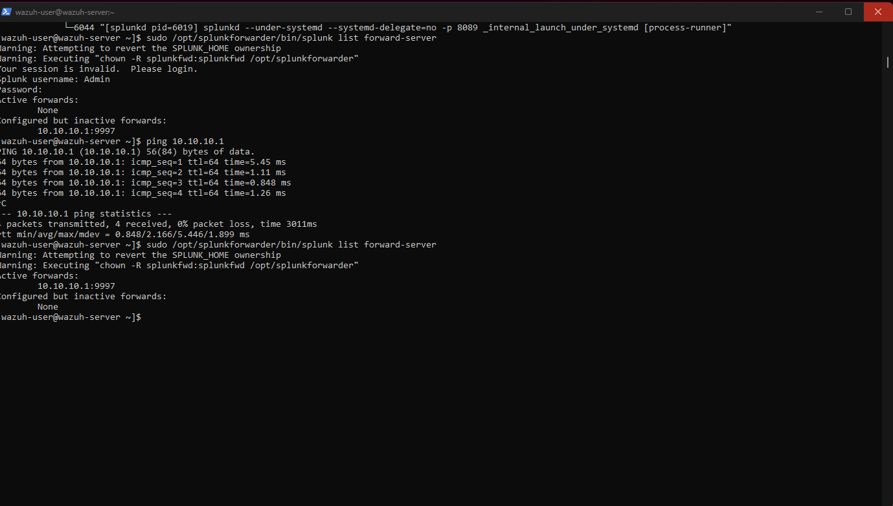

# Wazuh + Suricata + Splunk SOC Lab

## Project Overview

This project demonstrates the design and implementation of a Security Operations Center (SOC) lab using:

- Wazuh SIEM
- Suricata IDS
- Splunk Enterprise
- Splunk Universal Forwarder
- Kali Linux

The objective was to detect, collect, forward, and analyze security events generated from network attacks and host activities.

---

## Architecture

```text
Attacker
   │
   ▼
┌─────────────────────┐
│      Kali VM        │
│                     │
│ • Wazuh Agent       │
│ • Suricata IDS      │
│ • Splunk Enterprise │
└─────────┬───────────┘
          │
          ▼
┌─────────────────────┐
│    Wazuh Server     │
│                     │
│ • Wazuh Manager     │
│ • Dashboard         │
│ • Splunk Forwarder  │
└─────────┬───────────┘
          │ alerts.json
          ▼
       Port 9997
          │
          ▼
┌─────────────────────┐
│ Splunk Enterprise   │
│ Search & Dashboards │
└─────────────────────┘
```


### Components

| Component | Purpose |
|------------|------------|
| Kali Linux | Monitored endpoint |
| Wazuh Agent | Endpoint monitoring |
| Suricata IDS | Network intrusion detection |
| Wazuh Manager | Log collection and correlation |
| Splunk Universal Forwarder | Forwards Wazuh alerts |
| Splunk Enterprise | Log analysis and dashboarding |

---


## Technologies Used

- Wazuh
- Suricata
- Splunk Enterprise
- Splunk Universal Forwarder
- Linux
- JSON
- Syslog

---

# Wazuh and Suricata Integration

Suricata was integrated with Wazuh to provide centralized IDS monitoring.

### Verification

Suricata alerts were successfully collected by Wazuh and displayed in the Wazuh dashboard.

Screenshot:




---

# Splunk Integration

The Wazuh server was configured with Splunk Universal Forwarder.

Monitored file:

```bash
/var/ossec/logs/alerts/alerts.json
```

Forward target:

```bash
10.10.10.1:9997
```

---

## Splunk Configuration

### Add Forward Server

```bash
sudo /opt/splunkforwarder/bin/splunk add forward-server 10.10.10.1:9997
```

### Monitor Wazuh Alerts

```bash
sudo /opt/splunkforwarder/bin/splunk add monitor /var/ossec/logs/alerts/alerts.json -sourcetype wazuh
```

Screenshot:


---

# Security Event Collection

Logs successfully received in Splunk.

Screenshot:


---

# Attack Simulations

## Scenario 1 - Nmap Scan

### Attack

```bash
nmap -sS TARGET-IP
```

### Detection

- Suricata generated IDS alerts
- Wazuh collected alerts
- Splunk indexed alerts

### Evidence


---

## Scenario 2 - Brute Force Attack

### Tool

```bash
hydra
```

### Detection

- Authentication failures detected
- Logged in Wazuh
- Visible in Splunk

### Evidence


---

## Scenario 3 - SQL Injection

### Tool

```bash
sqlmap
```

### Detection

- Web attack detected
- Logged through Suricata
- Indexed by Splunk

### Evidence


---

# Splunk Queries

## Top Alert Types

```spl
index=main sourcetype=wazuh
| stats count by rule.description
```

## Top Source IPs

```spl
index=main sourcetype=wazuh
| stats count by data.src_ip
```

## Suricata Events

```spl
index=main sourcetype=wazuh
rule.groups{}="suricata"
```

## Alert Severity

```spl
index=main sourcetype=wazuh
| stats count by rule.level
```

---

# MITRE ATT&CK Mapping

| Attack | ATT&CK ID |
|----------|------------|
| Port Scan | T1046 |
| Brute Force | T1110 |
| Command Execution | T1059 |
| Discovery | T1087 |

---

# Key Skills Demonstrated

- SIEM Deployment
- IDS Integration
- Log Forwarding
- Security Monitoring
- Threat Detection
- Incident Analysis
- Linux Administration
- Splunk Search Processing Language (SPL)

---

# Results

Successfully implemented a SOC monitoring environment capable of:

- Collecting endpoint logs
- Detecting network threats
- Centralizing security events
- Forwarding alerts to Splunk
- Visualizing detections through dashboards

---

# Screenshots

| Description | Screenshot |
|------------|------------|
| Wazuh Dashboard | Included |
| Suricata Alerts | Included |
| Splunk Forwarder | Included |
| Splunk Search Results | Included |
| Attack Detection | Included |

---

# Author

OLADOTUN

Cybersecurity Analyst | SOC Analyst | SIEM Engineer
